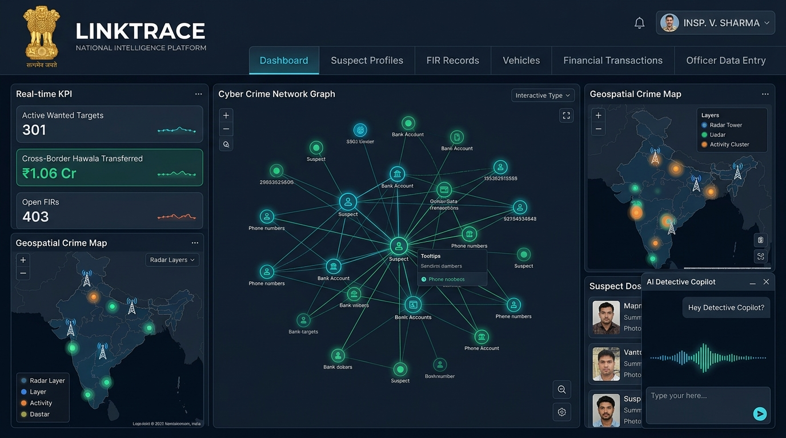

<div align="center">

# 🛡️ LinkTrace
### National Criminal Intelligence & Cross-Jurisdictional Link Analysis Platform
**Pan-India Crime Syndicate Tracking • Inter-State Money Trails • Telecom CDR Triangulation • AI Investigation Copilot**

<br />



<br />

[](https://www.python.org/)
[](https://developer.mozilla.org/en-US/docs/Web/JavaScript)
[](https://d3js.org/)
[](https://leafletjs.com/)
[](https://developer.mozilla.org/en-US/docs/Web/API/Web_Speech_API)
[](#tech-stack-used)

</div>

---
Direct Link - https://linktrace-kappa.vercel.app/
## 📌 Project Overview (Yeh Project Kya Karta Hai?)

**LinkTrace** is a next-generation **Law Enforcement Intelligence & Criminal Link Analysis Platform** designed to assist police departments and investigative agencies in solving complex, inter-state organized crime syndicates. 

In traditional policing, intelligence data such as First Information Reports (FIRs), Telecom Call Data Records (CDR), getaway vehicle logs, and illicit financial transactions (Hawala/Mule accounts) remain scattered across disparate state databases. **LinkTrace correlates these isolated puzzle pieces into a unified, interactive intelligence graph in real-time.**

### 🔍 Core Features & Capabilities:
1. **Interactive Criminal Network Graph (D3.js)**:
   - Visualizes multi-hop connections between kingpins, operatives, mule accounts, phone numbers, and FIR cases.
   - Allows investigators to click on any node to reveal dossiers or isolate shortest paths between co-conspirators.
2. **Pan-India GIS Crime & Cell Tower Radar (Leaflet.js)**:
   - Plots geospatial crime locations, telecom cell tower intercepts, and suspect sightings across India.
   - Offers regional filters for **North, South, East, West, and All-India** jurisdictions.
3. **Cross-Border Financial & Hawala Trail Tracking**:
   - Traces illicit money tranches across shell companies, mule bank accounts (UPI, IMPS, RTGS), and physical cash couriers.
   - Displays money flow arrows, amounts (₹ INR), bank narrations, and transaction IDs without clipping.
4. **Telecom CDR & Call Intercept Matrix**:
   - Analyzes caller-receiver timelines, call duration, IMEI numbers, and cell tower triangulation points.
5. **Multilingual AI Detective Copilot**:
   - In-dashboard intelligent assistant supporting **Hindi (हिन्दी), Hinglish, English, and regional Indian scripts** (Marathi, Bengali, Tamil, Telugu, Gujarati).
   - Automatically detects the officer's query language and replies with domain-accurate law enforcement terminology.
6. **Voice Assistant Desk (Speech-to-Text & Text-to-Speech)**:
   - **Voice Typing**: Officers can speak via their microphone to draft queries hands-free.
   - **Audio Readout (बोलकर सुनाएं)**: Reads intelligence briefs aloud in natural synthesized voice.
7. **Officer Data Entry Portal with Instant Real-Time Sync**:
   - Secure digital portal with 4 specialized modules: `Suspect Dossiers`, `FIR Records`, `Tracked Vehicles`, and `Financial Transactions`.
   - Adding a new record automatically updates `data.json`, synchronizes dashboard KPIs, and transports the officer directly to the category page with the new entry highlighted at the top (`✨ NEW ENTRY`).

---

## 🎯 Target Audience (Kin Logo Ke Liye Banaya Gaya Hai?)

LinkTrace is purposefully built for **Law Enforcement, Homeland Security, and Financial Crime Specialists**:

- 👮 **State Police Special Cells & Anti-Gang Squads** (e.g., Delhi Police Special Cell, Mumbai Crime Branch, UP STF) investigating inter-state armed heists, extortion rings, and organized gangs.
- 🏛️ **Central Law Enforcement & Intelligence Agencies** (e.g., NIA, CBI, Intelligence Bureau, Narcotics Control Bureau).
- 💻 **Cyber Crime Special Investigation Teams (SITs)** analyzing digital fraud, mule account rental networks, and coordinated phishing infrastructure.
- 💸 **Financial Intelligence Units (FIU) & Anti-Hawala Monitoring Cells** tracking money laundering tranches and layered shell bank accounts.
- 🕵️ **Field Investigating Officers (IOs) & Supervisory IPS Officers** who need immediate, cross-referenced intelligence on suspects during raids and transit interrogations.

---

## 🛠️ Tech Stack Used

LinkTrace is architected with a strict **zero-bloat, highly portable design** so that it can be deployed immediately in secure, air-gapped police command networks without managing complex dependency trees.

| Layer | Technology | Description & Usage |
| :--- | :--- | :--- |
| **Frontend UI** | **Vanilla HTML5 & CSS3** | Custom dark command palette, 2-tier navigation bar, responsive layouts, glassmorphism cards, and micro-animations. |
| **Frontend Logic** | **Vanilla JavaScript (ES6+)** | Pure modern JS modular state controller, dynamic view switching, DOM event bus, and asynchronous REST fetchers. |
| **Graph Visualization** | **D3.js v7** | Force-directed physics network simulation rendering dynamic nodes, edges, collision forces, and interactive zoom/pan. |
| **Geospatial GIS** | **Leaflet.js & OpenStreetMap** | High-performance interactive mapping engine rendering crime pins, cell towers, and multi-state jurisdiction boundaries. |
| **Voice & Speech** | **Web Speech API** | Native browser `SpeechRecognition` for voice typing & `SpeechSynthesis` for natural Indian-accented audio readouts. |
| **Backend Server** | **Python 3 Standard Library** | Built with `http.server`, `urllib.parse`, `pathlib`, and `json`. **No `pip install` or external frameworks required!** |
| **Intelligence Engine** | **Python 3 Graph Algorithm Module** | BFS shortest path solver, criminal dossier aggregator, full-text multi-field search engine, and timeline synthesizer. |
| **Database** | **JSON Storage (`data.json`)** | Portable, versionable, and human-readable structured intelligence repository storing suspects, FIRs, vehicles, CDRs, and bank ledgers. |

---

## 🚀 How to Run Locally

### Prerequisites:
- **Python 3.10+** (Default pre-installed on macOS and modern Linux/Windows).
- Modern web browser (Google Chrome, Microsoft Edge, Brave, or Safari).

### Steps:

1. **Clone the Repository**:
   ```bash
   git clone https://github.com/snehaagra-wal/linktrace.git
   cd linktrace
   ```

2. **Start the Command Server**:
   ```bash
   python3 backend/server.py
   ```

3. **Open the Dashboard**:
   Navigate to:
   ```text
   http://127.0.0.1:8765
   ```
   *Tip: Use the **"1-Click Demo Officer Login"** button on the login screen to jump straight into active command mode.*

---

## 🔒 Security & Data Confidentiality
- **Air-Gap Compatible**: Operates completely offline without sending telemetry or querying external cloud LLMs.
- **Role-Based Command UI**: Simulates verified officer authentication tags and audit logs.
- **SHA-256 Data Integrity**: Structured data modification is strictly validated against the server-side crime schema.

---

<div align="center">
  <sub>Developed for Law Enforcement & Intelligence Innovation • Satyameva Jayate 🇮🇳</sub>
</div>
